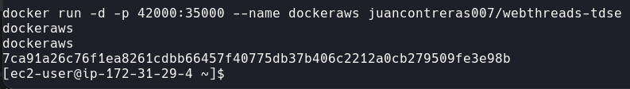
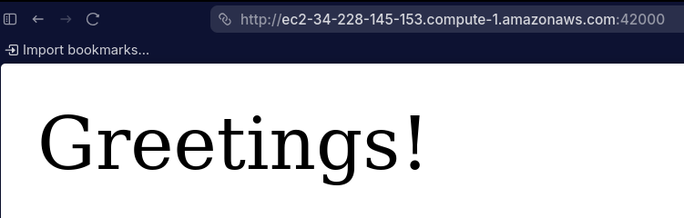
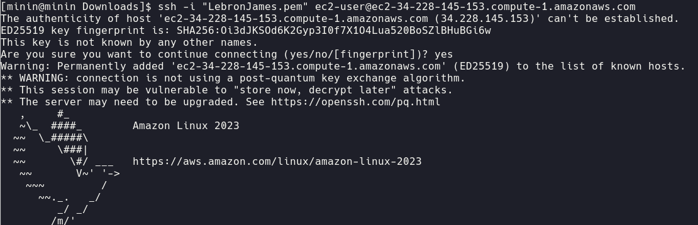
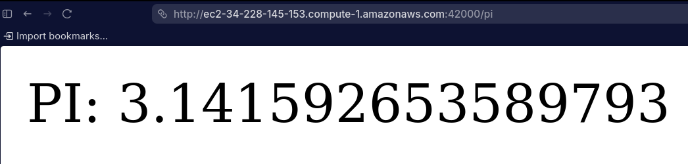
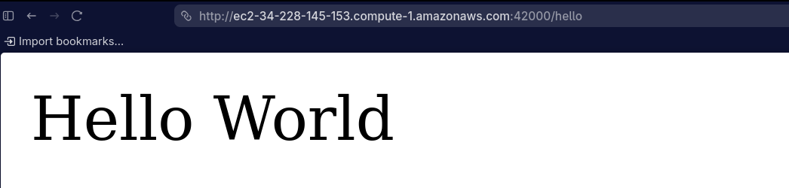

# Arquitectura de Servidores de Aplicaciones

## Juan Pablo Contreras Parra

A custom lightweight web framework built from scratch in Java, demonstrating how annotation-driven HTTP frameworks like Spring Boot work under the hood. The project implements classpath scanning, custom annotations, reflection-based routing, and a raw Java HTTP server.
This project was deployed in AWS using docker thanks to the professor's guide

### Concurrent Request Handling

This server uses a **thread-per-request concurrency model** to handle multiple clients simultaneously:

- **Thread Pool**: Each incoming client connection spawns a new Java `Thread` running a `ClientHandler` (implements `Runnable`)
- **Non-blocking**: The main server loop immediately returns to accepting new connections instead of blocking on request handling
- **Concurrent Execution**: Multiple client threads run in parallel, allowing the server to serve multiple requests simultaneously
- **Named Threads**: Each thread is named `Client-1`, `Client-2`, etc. for easy debugging and monitoring in server logs
- **Thread-Safe Shutdown**: Uses a volatile `running` flag and Java shutdown hooks to gracefully stop the server on `Ctrl+C`

Example: If 3 clients connect simultaneously, the server spawns 3 threads that process their requests in parallel, then closes their connections independently.

### Deployment proof video:

https://youtu.be/xDoRNAgK2Ms

---

## Table of Contents

1. [Concurrent Request Handling](#concurrent-request-handling)
2. [Architecture & Design](#architecture--design)
3. [Project Structure](#project-structure)
4. [Installation](#installation)
5. [Docker Build & Deployment](#docker-build--deployment)
6. [Running the Server](#running-the-server)
7. [Available Endpoints](#available-endpoints)
8. [Running Tests](#running-tests)
9. [AWS EC2 Deployment](#aws-ec2-deployment)

---

## Architecture & Design

### Overview

The system is composed of four layers:


### Custom Annotations

| Annotation | Target | Purpose |
|---|---|---|
| `@RestController` | Class | Marks a class as a web service component to be discovered during classpath scanning |
| `@GetMapping(value)` | Method | Declares the HTTP GET path that the method handles |
| `@RequestParam(value, defaultValue)` | Parameter | Binds a URL query parameter to a method argument, with optional default |

### Classpath Scanning

`DemoApplication` replicates what Spring's component scan does:

1. Reads `java.class.path` system property to find all classpath entries.
2. Recursively walks every directory, converting `.class` files to fully-qualified class names.
3. Loads each class with `Class.forName()` and checks for `@RestController`.
4. For every annotated class, iterates its methods looking for `@GetMapping`.
5. Builds a `Route` lambda (using reflection to resolve `@RequestParam` arguments) and registers it into `HttpServer.endPoints`.

### Request Lifecycle

```
Browser → TCP connect → ServerSocket.accept()
       → read HTTP request line → parse URI + query string
       → Request object (Map<String, String>)
       → endPoints.get(path) → Route.handle(req, res)
       → controller method invoked via reflection
       → HTML response written to OutputStream
       → socket closed
```

### Key Classes

| Class | Responsibility |
|---|---|
| `DemoApplication` | Entry point; classpath scanner; controller registrar |
| `HttpServer` | Raw TCP server; request parser; route dispatcher; static file server |
| `HelloController` | Handles `/`, `/pi`, `/hello` |
| `GreetingController` | Handles `/greeting?name=` |
| `Request` | Holds parsed query parameters |
| `Response` | Placeholder for future response helpers |
| `Route` | Functional interface: `(Request, Response) → String` |
| `WebMethod` | Simplified functional interface: `() → String` |
| `ManualTests` | Self-contained manual test runner (no test framework required) |

---

## Project Structure

```
src/
├── main/
│   ├── java/org/example/
│   │   ├── annotation/
│   │   │   ├── RestController.java        # Custom @RestController annotation
│   │   │   ├── GetMapping.java            # Custom @GetMapping annotation
│   │   │   └── RequestParam.java          # Custom @RequestParam annotation
│   │   ├── core/
│   │   │   ├── HttpServer.java            # Custom HTTP server (port 35000)
│   │   │   ├── ClientHandler.java         # Concurrent client request handler
│   │   │   ├── Request.java               # Query parameter DTO
│   │   │   ├── Response.java              # Response placeholder
│   │   │   ├── Route.java                 # Functional interface for handlers
│   │   │   └── WebMethod.java             # Simplified handler interface
│   │   ├── controller/
│   │   │   ├── HelloController.java       # @RestController — basic endpoints
│   │   │   └── GreetingController.java    # @RestController — /greeting?name=
│   │   ├── framework/
│   │   │   ├── ReflexionNavigator.java    # Reflection demo utility
│   │   │   └── InvokeMain.java            # Dynamic main() invoker demo
│   │   └── app/
│   │       ├── DemoApplication.java       # Bootstrap & classpath scanner
│   │       ├── ManualTests.java           # Framework-free test runner
│   │       └── ConcurrencyDemo.java       # Concurrent request demonstrator
│   └── resources/
│       └── application.properties
└── test/
    └── java/org/example/
        ├── annotation/
        │   └── AnnotationsTest.java
        ├── controller/
        │   ├── HelloControllerTest.java
        │   └── GreetingControllerTest.java
        └── core/
            ├── HttpServerTest.java
            └── RequestTest.java
```

---

## Installation

### Prerequisites

- Java 17+
- Maven (or use the included `mvnw` wrapper)

### Clone & Build

```bash
git clone <repository-url>
cd Arquitectura_Servidores_de_Aplicaciones-TDSE

mvn clean package

mvn dependency:copy-dependencies -DoutputDirectory=target/dependency

# Compile
./mvnw compile
```

---

## Docker Build & Deployment

### Build the Docker Image

```bash
# Step 1: Compile and package the project
./mvnw clean package

# Step 2: Build the Docker image
docker build -t virtualization-server:latest .
```

The build process:
1. Compiles Java source code to `target/classes/`
2. Copies dependencies to `target/dependency/` (via maven-dependency-plugin)
3. Docker copies both directories into the container
4. Sets OpenJDK 23 as the base image

### Run the Docker Container

```bash
# Run the server in Docker
docker run -p 35000:6000 virtualization-server:latest
```

The server will start inside the container and listen on port 35000. Access endpoints at `http://localhost:35000`

### Example Docker Commands

```bash
# List images
docker images | grep virtualization-server

# Run with container name
docker run --name my-server -p 35000:6000 virtualization-server:latest

# View running containers
docker ps

# Stop the container
docker stop my-server

# Remove the image
docker rmi virtualization-server:latest
```

### Docker Compose (Optional)

Create a `docker-compose.yml` file:

```yaml
version: '3.8'
services:
  web-server:
    build: .
    ports:
      - "35000:6000"
    container_name: virtualization-server
```

Then run:
```bash
docker-compose up --build
```

---

## Running the Server

### Option 1 — Java classpath

```bash
# Compile first
./mvnw compile

#Copy dependencies
mvn clean package
mvn dependency:copy-dependencies -DoutputDirectory=target/dependency

# Run
java -cp target/classes org.example.app.DemoApplication
```

The server starts on **[http://localhost:35000](http://localhost:35000)**.

---

## Available Endpoints

| Method | Path | Query Params | Example Response              |
|---|---|---|-------------------------------|
| GET | `/` | — | `Greetings from Spring Boot!` |
| GET | `/pi` | — | `PI: 3.141592653589793`       |
| GET | `/hello` | — | `Hello World`                 |
| GET | `/greeting` | `name` (default: `World`) | `Hola Juan`                   |

Example requests:

```bash
curl http://localhost:35000/
curl http://localhost:35000/pi
curl http://localhost:35000/hello
curl http://localhost:35000/greeting?name=Juan
```

---

## AWS Docker






## Running Tests

### JUnit 5 automated tests

```bash
./mvnw test
```

Expected output:


### Manual test runner (no test framework required)

```bash
# Compile first if needed
./mvnw compile

java -cp target/classes org.example.demo.ManualTests
```

Expected output:


---

## AWS EC2 Deployment

### Instance Details


---

### SSH Connection



```bash
ssh -i "LebronJames.pem" ec2-user@ec2-34-228-145-153.compute-1.amazonaws.com
```

---

### Deploying the Application


---

### Accessing the Application from a Browser




